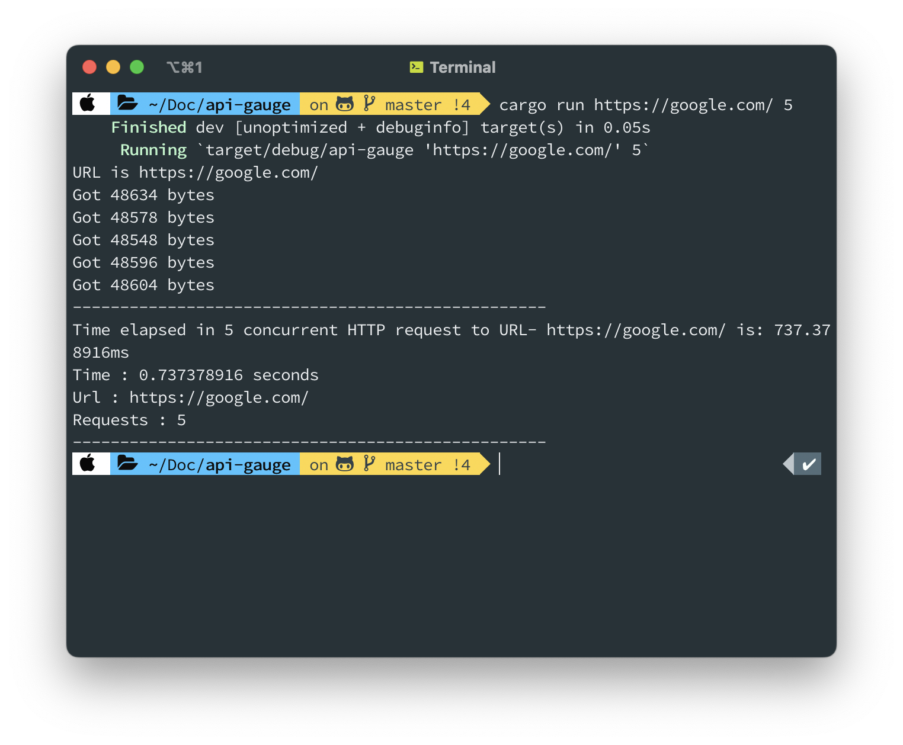

# API-GAUGE

[](https://github.com/ellerbrock/open-source-badges/)
[](https://opensource.org/licenses/mit-license.php)

<br>
Built with Rust
<br> 
<h2>Functionality :</h2> Measure how your API performs when a lot of concurrent requests are made.

**Webpage:** [api-gauge](https://r97draco.github.io/api-gauge/)

## How to start
1. ```git clone https://github.com/r97draco/api-gauge.git ```
2. Run following command to run the code (sends 1 requests by default to https://google.ca/)
<br>```cargo run```
2. Run following in terminal
<br>```cargo run [url_of_site] [number_of_requests]```
<br> Example :
<br>```cargo run https://google.com/ 30 ```

## Showcase


## Dependencies
- reqwest = { version = "0.11.14", features = ["json"] }
- tokio = { version = "1.24.2", features = ["full"] }
- serde = { version = "1.0.152", features = ["derive"] }
- serde_json = "1.0.91"
- futures = "0.3.25"

**Members:**
1. [Jagroop Singh](https://github.com/r97draco)
2. [Harmandeep Singh](https://github.com/singh47)
